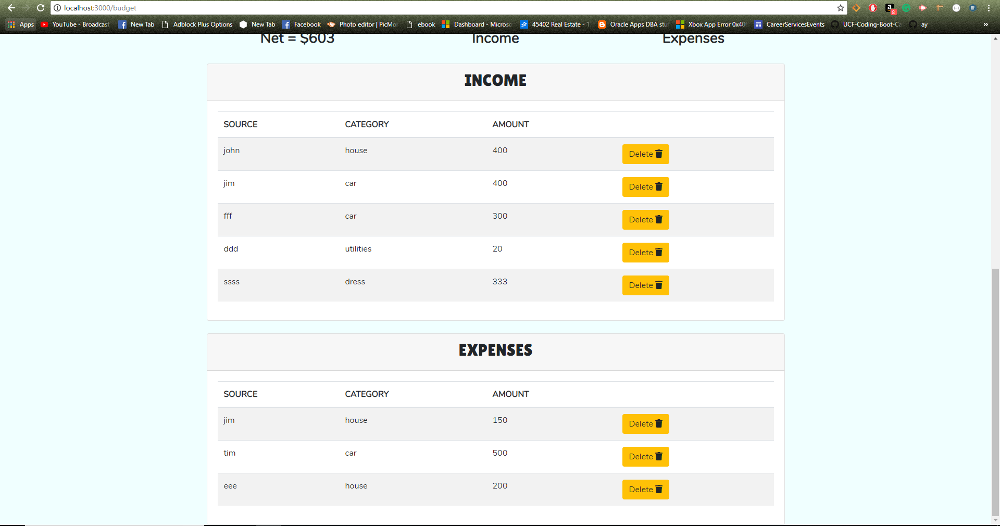

# Budget Minder

### This is a collaborative group project for the UCF Coding Bootcamp. For this project we were required to use Node and Express Web Server. We had to have a MySQL Database with a Sequelize ORM. We had to utilize both GET, POST and CREATE routes for retrieving and adding new data. The new technology that we used in this project is Chart.js. We also had to use the MVC Paradigm folder structure. The project that we chose to make was a budget tracker web app which we named Budget Minder. This web application will help you keep track of how much income  and expenses that you have per month. You will be able to see in a chart your income versus your expenses, and be shown your net profit. There are also two other charts that will show your income and expenses in  categories.

## Screenshot

</ br>

## Technologies Used
 * HTML
 * CSS
 * JavaScript
 * MySQL
 * Heroku
 * Ajax
 * Sequelize
 * Chart.JS
 * Handlebars

 ## Collaborators
 * https://github.com/MinneolaMike
 * https://github.com/chrismayo23
 * https://github.com/Deepastar
 * https://github.com/venularfiber1
